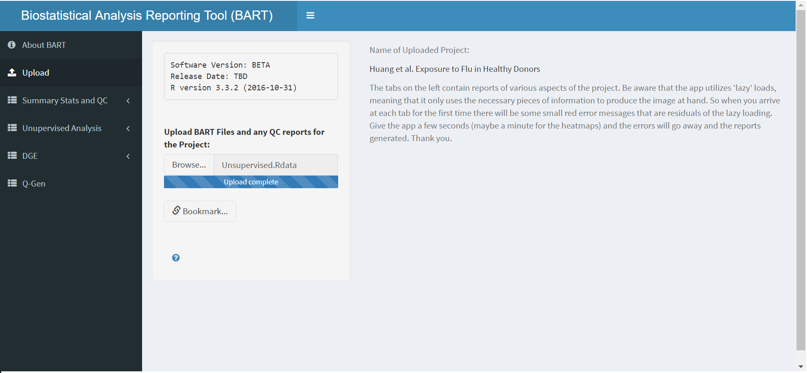
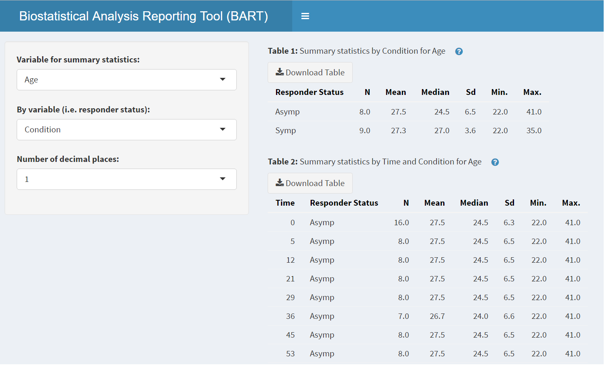
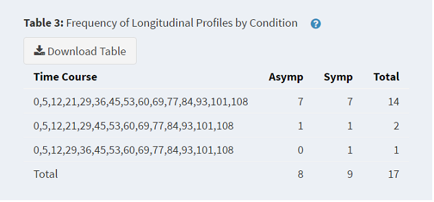
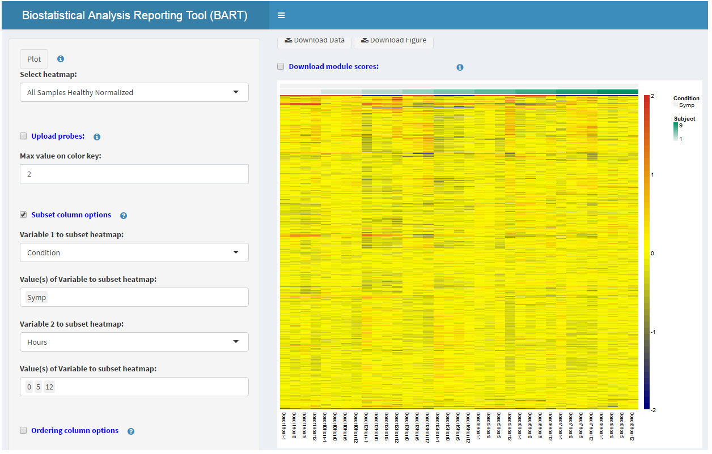
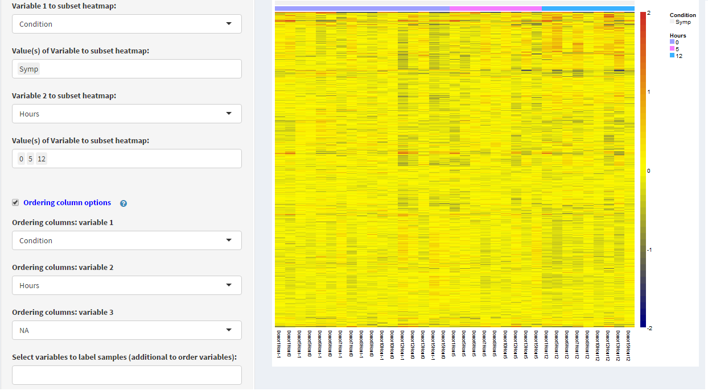
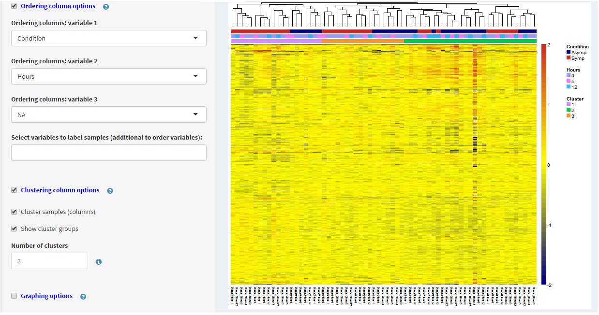
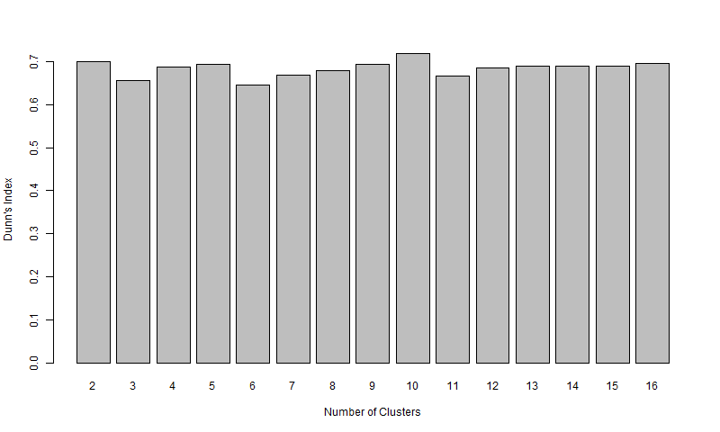
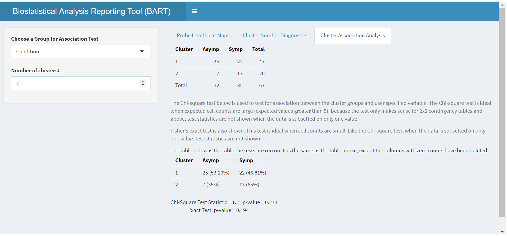
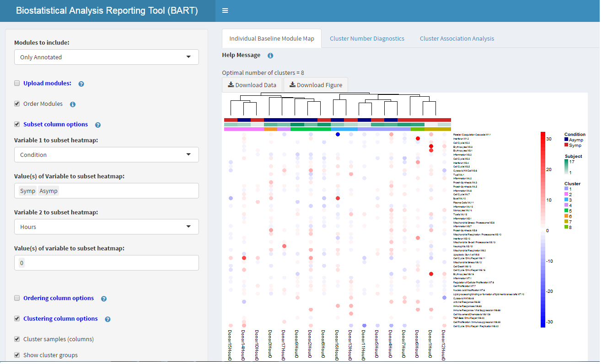
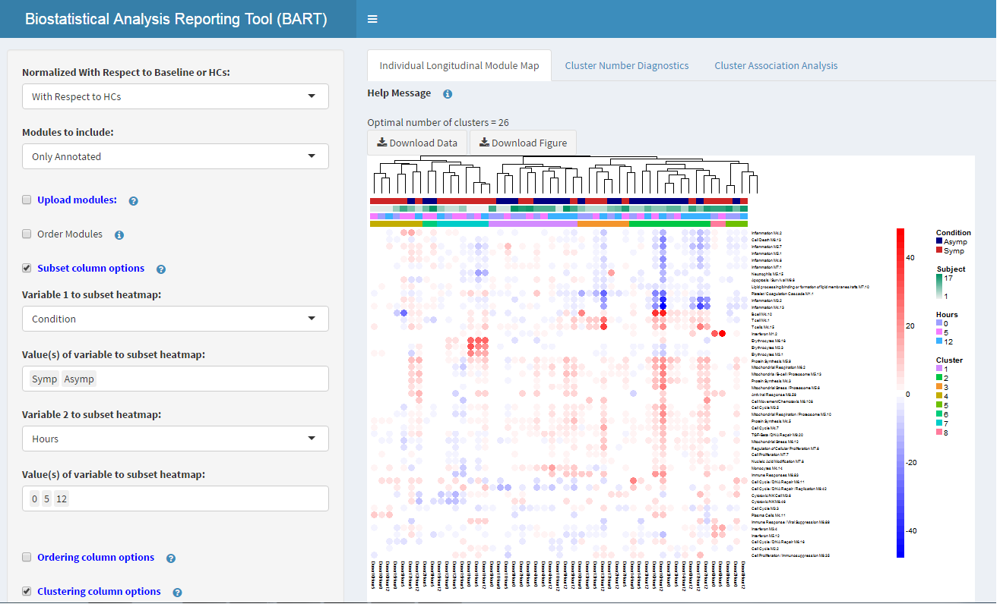

<h1 style = "text-align: center; color: blue"><b>BART: Biostatistical Analysis Reporting Tool</b></h1>

## <b>Introduction</b>

BART is a user friendly, point and click, R shiny application that was developed as a reporting tool for a broad range of high throughput studies such as RNA sequencing, Microarray, and Flow Cytometry. BART provides users with the ability to interactively view the entire analysis workflow:

  
- Design file summary statistics
- Quality control metrics 
- Unsupervised Analysis (heatmaps and clustering)
- Differential gene expression (easily sortable genelists, venn diagrams)
- Gene set analysis 

BART reports the data and analysis results by generating a variety of downloadable interactive tables, plots, heat maps, module maps, and venn diagrams that are designed to quickly identify genes and other variables of interest. One of the major advantages of BART is its ability to efficiently sort through, summarize, and report large amounts of results across potentially many comparisons of interest. In the following sections, we give an overview and brief "how to" of each of the tools BART offers.

## <b>Upload</b>

The <b>Upload</b> tab is where every BART session begins. The user can click the <b>Browse</b> button and select the appropriate BART files from his local machine. Upon uploading, other menu tabs will appear based on the content of the uploaded files. For example, if a BART file only contains the design and expression files and the results from differential analysis, the tabs <b>Summary Stats and QC</b>, <b>Unsupervised Analysis</b>, and <b>DGE</b> will be the only ones available to view.

<figure><figcaption><b>This uploaded BART file contains the design and expression files, differential analysis results, and gene set analysis results.</b></figcaption></figure>

## <b>Design File and Summary Statistics</b>

These tabs display the design file and various summaries of the information contained in it. A design file typically contains patient/sample information factors such as condition (disease or healthy control), responder status (responding to medication or not), age, weight, height, sex, race, demographics, etc. As an example, with such information it may be of interest to know the breakdown of age across the different conditions. This is made possible in the <b>Summary Statistics</b> tab. The tool allows the user to select a variable from the design file to summarize over (Age), along with a "by variable" that will further divide the groups (Condition). Continuing with the example, the resulting tables will show summary statistics of patient age broken down by condition. If the study is longitudinal, the second table shows the summaries at each time point. Finally, the third table shows a breakdown of missing information by showing how many patients in each condition have a recording at each time point.

<figure><figcaption><b>Tables showing (1) Age by Condition and (2) Age by Condition and Time.</b></figcaption></figure>

<figure><figcaption><b>Table showing (3) number of patients that have recordings at each time point.</b></figcaption></figure>

## <b>Unsupervised Analysis</b>

A common tool in unsupervised learning is cluster analysis, a method used to infer structure and pattern in the data before statistical rigor has been applied. By default, BART generates heat maps whose rows (genes/modules) are hierarchical clustered. One of the common questions of interest for researchers during this stage of analysis is "Do the heat maps show a visible difference between patient groups of interest (i.e. responders vs non-responders)?". And in a longitudinal setting, "Is there a visibily detectable pattern in the patient groups over time? If so, do the patterns differ between the groups?". The tools in BART are designed to answer these questions. We walk through the three sub-menu options under <b>Unsupervised Analysis</b> below.

<h3>Probe Level Heat Maps</h3>

This sub-menu option generates a page with three tabs at the top:

<h5 style = "font-size: 120%"> <i>Probe Level Heat Maps</i></h5>

This tab generates a probe (gene) level heat map, in which the rows are genes and the columns are samples. BART provides users with the ability to view the data normalized different ways in the <b>Select heatmap</b> option. The available options depend on the study at hand. For example, a longitudinal study with healthy controls would have the following options:

1. 
Baseline samples only - median normalized or healthy normalized
 
2. 
All samples - median normalized, baseline normalized, or healthy normalized

Clearly, if the study is not longitudinal or doesn't have healthy controls, some of those options are not possible, and thus BART makes them unavailable. By default, the heat map plots all of the genes in the filtered, log2 transformed, and ready for analysis expression set. If a user wishes to only plot a subset of those genes, BART provides an <b>Upload probes</b> option that allows the user to upload the desired list of genes in a CSV file (pop-up help box beside the option provides formatting details). Many times a heat map can be thrown off by a few outliers that cause the range of colors that are plotted to be dull for a majority of the data. In the <b>Max value on color key</b> option, BART allows the user to choose a cutoff value whose default is 2. This forces any values less than -2 equal to -2 and any values greater than 2 equal to 2. A user may only want to plot a certain subset of the samples. In the <b>Subset column options</b>, BART allows the user to select up to two variables (and their values) at a time from which to subset on. For example, if a user only wants to view subjects with a particular condition at a particular time, he would subset on variables condition and time and then choose the particular condition and times of interest from the values option.

<figure><figcaption><b>In this figure, the samples are subsetted by variable Condition with value Symp and variable Hours with values 0, 5, and 12.</b></figcaption></figure>
 

In the figure above, notice that the heat map is subsetted on condition and time. However, the labels above the heat map don't show a labeling for time, which may be of interest to the user. The <b>Ordering columns options</b> allows the users to select variables from the design file with which to order the samples by and provide labeling at the top of the map. To order order on condition and time, the user would select Condition for <i>Ordering columns: variable 1</i> and Hours for <i>Ordering columns: variable2</i>.

<figure><figcaption><b>Samples are chosen to be ordered by Condition and Hours.</b></figcaption></figure>

 Oftentimes, a researcher is interested in seeing how the samples cluster together or if they cluster by groups of interest. Another, more complicated question that often arises is what is the optimal number of clusters that the samples should be divided into? BART provides some tools that attempt to poke at these interests and questions. The <b>Clustering columns option</b> contains two sub-options:

1. 
Cluster samples - If clicked, performs hierarchical clustering of the samples and displays the dendrogram over the columns of the heat map.

2. 
Show cluster groups - If clicked, colored cluster annotation of the heat map is displayed. The default number of clusters is determined by the Dunn index, a metric used to try and determine the "optimal" number of clusters in a set. The default can be changed by the user if he wants to see a different number than what the Dunn index suggests.

<figure><figcaption><b>Clustering options are chosen and number of cluster groups chosen is 3.</b></figcaption></figure>

 The last few options related to the heat map are graphing options that allow the user to adjust the height, width, font size (legend and column text), legend size, and dendrogram height of the heat map. The last option allows the user to adjust the resolution of the heat map when downloaded.

<h5 style = "font-size: 120%"> <i>Cluster Number Diagnostics</i></h5>

This tab shows a bar plot of the Dunn index versus the number of clusters the samples are separated into. Since one cluster is simply the entire set, we begin with 2 clusters and work our way up to <i>n</i> (half the number of samples in the heat map). Thus, the plot is dependent on and reactive to the heat map generated on the first tab. The "optimal" number of clusters is the <i>n</i> at which the Dunn index is a maximum. Often times, the global maximum occurs at a number that is too high to be meaningful. In such cases, the bar plot is useful to search for local maximum (peaks) in the Dunn index and use those as candidates for the "optimal" number.

<figure><figcaption><b>In this figure, the Dunn index is highest at 10. Thus, 10 is chosen as the "optimal" number. However, we also see a local maximum at 5, so it may be a worthy candidate to consider.</b></figcaption></figure>

<h5 style = "font-size: 120%">  <i>Cluster Association Analysis</i></h5>

This tool is also reactive to the heat map on the first tab. It tests for association between cluster groups (number selected by the user) and a variable of interest selected by the user. Both the Chi-square test and Fisher's exact test are run. It is advised that Fisher's exact test be used when expected cell counts are small (more than 20% of the cells have expected counts less than 5). BART notifies the user when this is the case. 

<figure><figcaption><b>Tests for association are conducted between two cluster groups and condition. The p-values are not significant.</b></figcaption></figure>

<h3>Baseline and Longitudinal Module Maps</h3>

The tools provided in these sub-menu options are essentially the same as the ones for the gene level heat map. We will highlight the areas in which they differ. The most obvious difference is the heat map itself. The maps in these tabs are constructed off of Baylor modules, collections of biologically similar and generally co-regulated genes. The values that are actually plotted are constructed on individual samples at baseline (<b>Module Map Baseline</b>) and for all time points (<b>Module Map Longitudinal</b>). By default, healthy control samples are used to determine an upper and lower threshold (mean HC +/- 2 sd). The module proportion for each sample is then calculated based on the percentage of probes within a module that are above or below this threshold. For example, if 40% of the probes within a module are above the threshold and 15% are below it, then the final module score would be 40% - 15% = 25% up. If the study is longitudinal but there are no healthy controls then the baseline module map cannot be generated and the baseline samples are then used to determine the threshold in the longitudinal module map.  
In addition to the Dunn index bar plot and cluster association tests, all of the subsetting, ordering, clustering, and graphing options available for the probe level heat map are also available for the module maps. For both the baseline and longitudinal maps, the <b>Modules to include</b> option allows the user to select a grouping of modules to plot. The choices are to plot only the annotated modules, the first seven rounds (M1.1 to M7.9), or all of them. As in the probe level tool, the user has the option to upload a specific set of modules to include. By default, the modules are clustered but the <b>Order Modules</b> option allows the user to order by module number or by the order of an uploaded list. For a longitudinal study with healthy controls, the very first option in the <b>Module Map Longitudinal</b> tab is to select whether the percentages are calculated relative to the healthy controls or the baseline samples (normalized with respect to healthy or baseline). The third option, labeled "Percentage Differences", simply subtracts the percentage scores using baseline samples from the percentage scores using healthy controls. This attempts to get at a module score that is "normalized to healthy controls with respect to baseline".

<figure><figcaption><b>Baseline module map showing only the annotated modules.</b></figcaption></figure>

<figure><figcaption><b>Longitudinal module map plotting time points 0, 5, and 12.</b></figcaption></figure>

## <b>Differential Gene Expression</b>

The <b>DGE</b> menu option provides tools to sort through and investigate the results from differential gene expression analysis. BART is designed to begin with a broad overview of results and then dig deeper into the significant results as the user progresses through the app. With this flow in mind, we walk through the different sub-menu options below: 

<h3>Overview</h3>

The first sub-menu option of this section generates a table of significant probe counts (raw, fdr, and bonferroni) for each comparison run in the analysis. The significance threshold can be adjusted by the user in the <b>Significance threshold</b> option (default value .05). Additionally, if the user wishes to see the overview for positive or negative differences, he may do so by adjusting the <b>Fold change sign</b> option accordingly. For example, in a longitudinal study, if there are many comparisons of certain time points vs baseline, the user may be interested in seeing the breakdown of positive and negative differences within the pool of significant genes.

<figure><figcaption><b>Table showing the number of significant genes for each comparison at a significance threshold of .05.</b></figcaption></figure>

<h3> Gene List Maker</h3>

This section of BART provides users with tools to dive deeper into the differential analysis results. Users can create their own genelists for any comparison the analysis conducted, view module maps and heat maps based off of these lists, and create venn diagrams to compare multiple comparisons at once. There are seven tabs within this section, three of which are essentially replicates of the probe level heat map tool but with options for the user to select gene lists based off a significance threshold and/or fold change filter. To avoid redundancy, we will only walk through the four other tabs.

<h5 style = "font-size: 120%"> <i>DGE: Gene Lists</i></h5>

The main function of this tab is to create gene lists based off of significance thresholds and/or fold change filters for a comparison of interest. The first option in the left panel, <b>Comparison</b>, asks the user to choose a comparison from a list of all the comparisons conducted in the analysis. The second set of options, <b>Testing and fold change subsetting options</b>, allows the user to select a multiple testing method (FDR, Bonferroni, or Raw), the significance threshold, and a fold change filter in which only genes with fold changes of a certain magnitude and/or direction will be kept. For example, if the user chooses <i>FC cut off = 0.5</i> and <i>Fold change sign = +</i>, then only genes with fold changes greater than 0.5 will be kept. If <i>Fold change sign = Both</i>, then only genes in which the absolute value of the fold changes are greater than 0.5 will be kept. If the user checks the <b>Merge module information</b> option, then the module numbers and module annotations (if annotated) are merged to the gene list table.  
Both the module map and gene list table generated in this tab are completely reactive to the user inputs described above. The module map shows the first seven rounds of the Baylor modules, and the percentages are calculated by taking the significant probes (determined from the genelist) within each module, counting the number that are up and down regulated, and then dividing each of those counts by the entire set of probes within the module to obtain a percentage up and percentage down. These percentages are then subtracted from each other to obtain the final module score. For example, suppose a module contains 50 probes, 10 of which are significantly up and 15 of which are significantly down (20% up and 30% down). The final module score would be calculated as 20% - 30% = -10% or 10% down. 

<h5 style = "font-size: 120%"> <i>DGE: Diagnostics</i></h5>

<h5 style = "font-size: 120%"> <i>DGE: Module Analysis Overview</i></h5>

<h5 style = "font-size: 120%"> <i>Venn Diagram</i></h5>

## <b>Gene Set Analysis</b>

## <b>Flow Cytometry</b>

## <b>Correlations</b>

